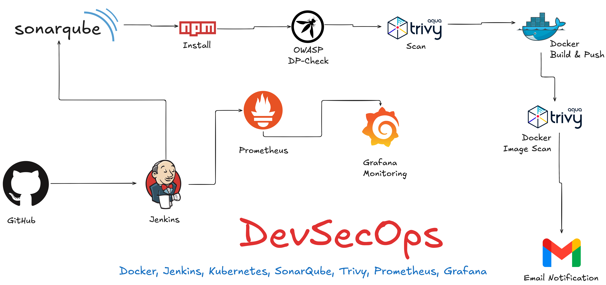
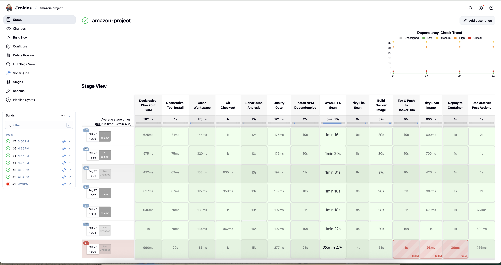
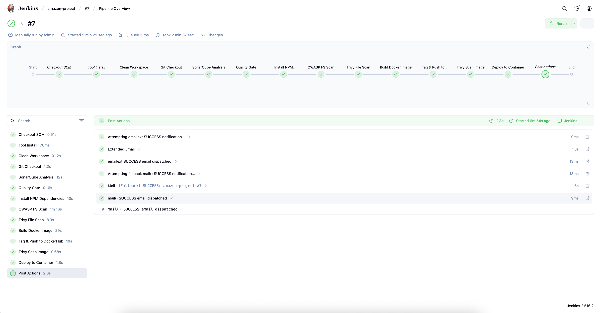
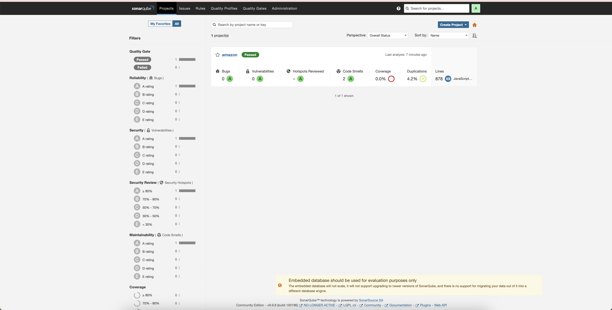
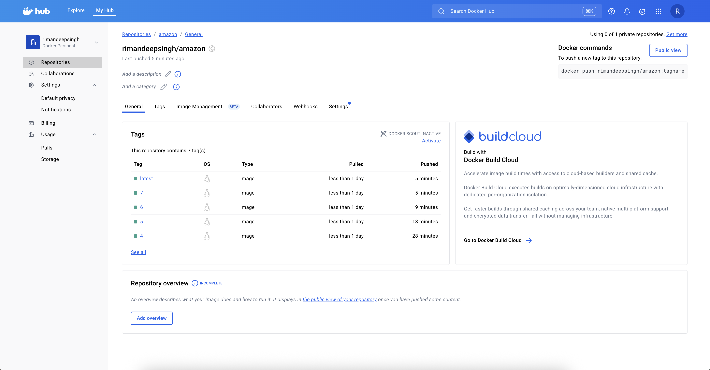
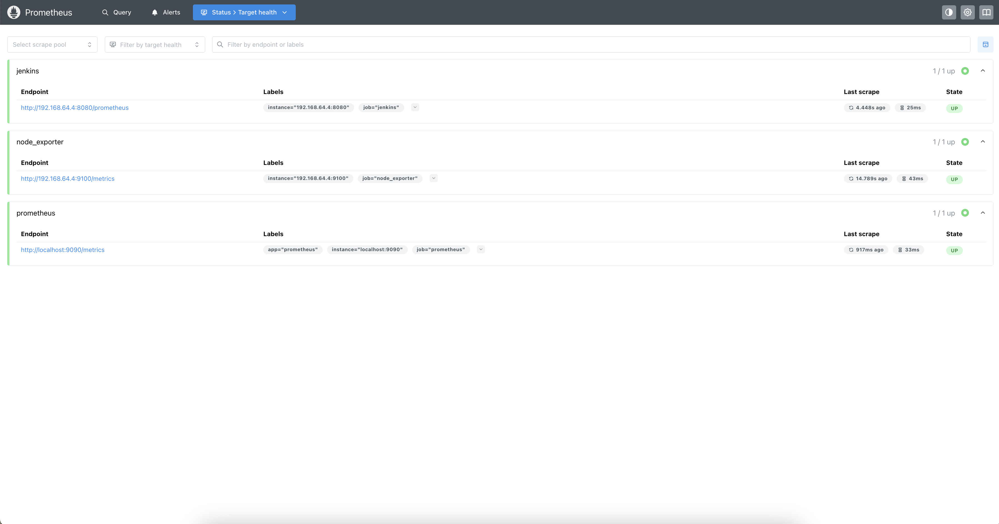
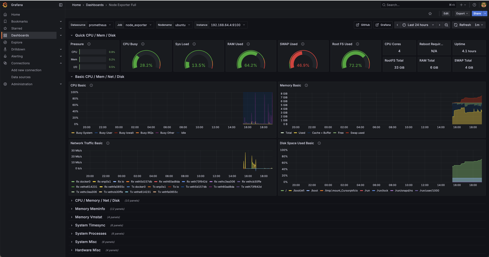
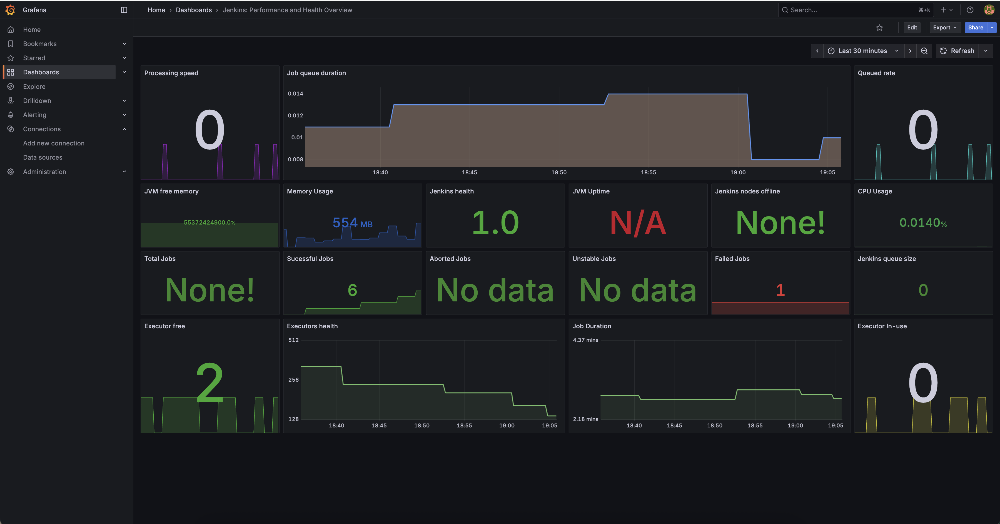

# Amazon Shopping Website — CI/CD DevSecOps Guide

This README documents how to build, scan, containerize, deploy, and monitor the React-based Amazon clone using a Jenkins CI/CD pipeline with DevSecOps tooling. Commands are tailored for Ubuntu/Debian-like systems—adjust for your environment as needed.

---

## Project Overview

This project is a React front-end e-commerce demo with a CI/CD pipeline implemented in Jenkins. The pipeline performs source checkout, code analysis (SonarQube), SCA scanning (OWASP Dependency-Check), filesystem and container image scanning (Trivy), Docker image build and push, and deployment of the container locally on the Jenkins node. Optional monitoring uses Prometheus, Node Exporter, and Grafana.

## Repository Structure

```
amazon-Devsecops/
  ├─ src/                  # React app source
  ├─ public/               # Static assets
  ├─ Dockerfile            # Builds production image
  ├─ Jenkinsfile           # CI/CD pipeline
  ├─ k8s-80/               # Example k8s manifests (HTTP)
  ├─ k8s-hostbased-https/  # Example k8s manifests (ALB host-based)
  └─ README.md
```

## Screenshots

Screenshots are stored in the `screenshots/` folder. The images below should now display properly on GitHub:











## Run Locally

From the project root:

```bash
npm install
npm start
```

Production build:

```bash
npm run build
```

## Table of Contents

-   [Prerequisites](#prerequisites)
-   [System Update & Common Packages](#system-update--common-packages)
-   [Java](#java)
-   [Jenkins](#jenkins)
-   [Docker](#docker)
-   [Trivy](#trivy-vulnerability-scanner)
-   [Prometheus](#prometheus)
-   [Node Exporter](#node-exporter)
-   [Grafana](#grafana)
-   [Jenkins Plugins to Install](#jenkins-plugins-to-install)
-   [Jenkins Credentials to Store](#jenkins-credentials-to-store)
-   [Jenkins Tools Configuration](#jenkins-tools-configuration)
-   [Jenkins System Configuration](#jenkins-system-configuration)
-   [EKS ALB Ingress Kubernetes Setup Guide](#eks-alb-ingress-kubernetes-setup-guide)
-   [Monitor Kubernetes with Prometheus](#monitor-kubernetes-with-prometheus)
-   [Installing Argo CD](#installing-argo-cd)
-   [Notes and Recommendations](#notes-and-recommendations)

---

## Ports to Enable in Security Group

| Service       | Port |
| ------------- | ---- |
| HTTP          | 80   |
| HTTPS         | 443  |
| SSH           | 22   |
| Jenkins       | 8080 |
| SonarQube     | 9000 |
| Prometheus    | 9090 |
| Node Exporter | 9100 |
| Grafana       | 3000 |

---

## Prerequisites

This guide assumes an Ubuntu/Debian-like environment and sudo privileges.

---

## System Update & Common Packages

```bash
sudo apt update
sudo apt upgrade -y

# Common tools
sudo apt install -y bash-completion wget git zip unzip curl jq net-tools build-essential ca-certificates apt-transport-https gnupg fontconfig
```

Reload bash completion if needed:

```bash
source /etc/bash_completion
```

**Install latest Git:**

```bash
sudo add-apt-repository ppa:git-core/ppa
sudo apt update
sudo apt install git -y
```

---

## Java

Install OpenJDK:

```bash
sudo apt update
sudo apt install fontconfig openjdk-21-jre
java -version
```

---

## Jenkins

Official docs: https://www.jenkins.io/doc/book/installing/linux/

```bash
sudo wget -O /etc/apt/keyrings/jenkins-keyring.asc \
  https://pkg.jenkins.io/debian-stable/jenkins.io-2023.key
echo "deb [signed-by=/etc/apt/keyrings/jenkins-keyring.asc]" \
  https://pkg.jenkins.io/debian-stable binary/ | sudo tee \
  /etc/apt/sources.list.d/jenkins.list > /dev/null
sudo apt-get update
sudo apt install -y jenkins

sudo systemctl enable jenkins
sudo systemctl start jenkins
sudo systemctl status jenkins
```

Initial admin password:

```bash
sudo cat /var/lib/jenkins/secrets/initialAdminPassword
```

Then open: http://your-server-ip:8080

**Note:** Jenkins requires a compatible Java runtime. Check the Jenkins documentation for supported Java versions.

---

## Docker

Official docs: https://docs.docker.com/engine/install/ubuntu/

```bash
# Add Docker's official GPG key:
sudo apt-get update
sudo apt-get install ca-certificates curl
sudo install -m 0755 -d /etc/apt/keyrings
sudo curl -fsSL https://download.docker.com/linux/ubuntu/gpg -o /etc/apt/keyrings/docker.asc
sudo chmod a+r /etc/apt/keyrings/docker.asc

# Add the repository to Apt sources:
echo \
  "deb [arch=$(dpkg --print-architecture) signed-by=/etc/apt/keyrings/docker.asc] https://download.docker.com/linux/ubuntu \
  $(. /etc/os-release && echo "${UBUNTU_CODENAME:-$VERSION_CODENAME}") stable" | \
  sudo tee /etc/apt/sources.list.d/docker.list > /dev/null
sudo apt-get update

sudo apt-get install docker-ce docker-ce-cli containerd.io docker-buildx-plugin docker-compose-plugin

# Add user to docker group (log out / in or newgrp to apply)
sudo usermod -aG docker $USER
newgrp docker
docker ps
```

If Jenkins needs Docker access:

```bash
sudo usermod -aG docker jenkins
sudo systemctl restart jenkins
```

Check Docker status:

```bash
sudo systemctl status docker
```

---

## Trivy (Vulnerability Scanner)

Docs: https://trivy.dev/v0.65/getting-started/installation/

```bash
sudo apt-get install wget gnupg
wget -qO - https://aquasecurity.github.io/trivy-repo/deb/public.key | gpg --dearmor | sudo tee /usr/share/keyrings/trivy.gpg > /dev/null
echo "deb [signed-by=/usr/share/keyrings/trivy.gpg] https://aquasecurity.github.io/trivy-repo/deb generic main" | sudo tee -a /etc/apt/sources.list.d/trivy.list
sudo apt-get update
sudo apt-get install trivy

trivy --version
```

---

## Prometheus

Official downloads: https://prometheus.io/download/

**Installation steps:**

```bash
# Create a prometheus user
sudo useradd --system --no-create-home --shell /usr/sbin/nologin prometheus

wget -O prometheus.tar.gz "https://github.com/prometheus/prometheus/releases/download/v3.5.0/prometheus-3.5.0.linux-amd64.tar.gz"
tar -xvf prometheus.tar.gz
cd prometheus-*/

sudo mkdir -p /data /etc/prometheus
sudo mv prometheus promtool /usr/local/bin/
sudo mv consoles/ console_libraries/ /etc/prometheus/
sudo mv prometheus.yml /etc/prometheus/prometheus.yml

sudo chown -R prometheus:prometheus /etc/prometheus /data
```

**Systemd service** (`/etc/systemd/system/prometheus.service`):

```ini
[Unit]
Description=Prometheus
Wants=network-online.target
After=network-online.target

[Service]
User=prometheus
Group=prometheus
Type=simple
Restart=on-failure
RestartSec=5s
ExecStart=/usr/local/bin/prometheus \
  --config.file=/etc/prometheus/prometheus.yml \
  --storage.tsdb.path=/data \
  --web.console.templates=/etc/prometheus/consoles \
  --web.console.libraries=/etc/prometheus/console_libraries \
  --web.listen-address=0.0.0.0:9090

[Install]
WantedBy=multi-user.target
```

**Enable & start:**

```bash
sudo systemctl daemon-reload
sudo systemctl enable prometheus
sudo systemctl start prometheus
sudo systemctl status prometheus
```

Access: http://ip-address:9090

---

## Node Exporter

Docs: https://prometheus.io/docs/guides/node-exporter/

```bash
sudo useradd --system --no-create-home --shell /usr/sbin/nologin node_exporter

wget -O node_exporter.tar.gz "https://github.com/prometheus/node_exporter/releases/download/v1.9.1/node_exporter-1.9.1.linux-amd64.tar.gz"
tar -xvf node_exporter.tar.gz
sudo mv node_exporter-*/node_exporter /usr/local/bin/
rm -rf node_exporter*
```

**Systemd service:** (`/etc/systemd/system/node_exporter.service`)

```ini
[Unit]
Description=Node Exporter
Wants=network-online.target
After=network-online.target

[Service]
User=node_exporter
Group=node_exporter
Type=simple
Restart=on-failure
ExecStart=/usr/local/bin/node_exporter --collector.logind

[Install]
WantedBy=multi-user.target
```

Enable & start:

```bash
sudo systemctl daemon-reload
sudo systemctl enable node_exporter
sudo systemctl start node_exporter
sudo systemctl status node_exporter
```

**Prometheus scrape config:**

Add to `/etc/prometheus/prometheus.yml`:

```yaml
- job_name: "node_exporter"
  static_configs:
      - targets: ["<ip-address>:9100"]

- job_name: "jenkins"
  metrics_path: /prometheus
  static_configs:
      - targets: ["<jenkins-ip>:8080"]
```

Validate config:

```bash
promtool check config /etc/prometheus/prometheus.yml
sudo systemctl restart prometheus
```

---

## Grafana

Docs: https://grafana.com/docs/grafana/latest/setup-grafana/installation/debian/

```bash
sudo apt-get install -y apt-transport-https software-properties-common wget

sudo mkdir -p /etc/apt/keyrings/
wget -q -O - https://apt.grafana.com/gpg.key | gpg --dearmor | sudo tee /etc/apt/keyrings/grafana.gpg > /dev/null

echo "deb [signed-by=/etc/apt/keyrings/grafana.gpg] https://apt.grafana.com stable main" | sudo tee -a /etc/apt/sources.list.d/grafana.list

sudo apt-get update
sudo apt-get install -y grafana

sudo systemctl daemon-reload
sudo systemctl enable --now grafana-server
sudo systemctl start grafana-server
sudo systemctl status grafana-server
```

Access: http://ip-address:3000

---

Datasource: http://prometheus-ip:9090

Recommended dashboards:

-   Node Exporter (ID: 1860) — https://grafana.com/grafana/dashboards/1860-node-exporter-full/
-   Jenkins (ID: 9964) — https://grafana.com/grafana/dashboards/9964-jenkins-performance-and-health-overview/
-   Kubernetes (ID: 18283) — https://grafana.com/grafana/dashboards/18283-kubernetes-dashboard/

## Jenkins Plugins to Install

-   Eclipse Temurin installer Plugin
-   NodeJS
-   Email Extension Plugin
-   OWASP Dependency-Check Plugin
-   Pipeline: Stage View Plugin
-   SonarQube Scanner for Jenkins
-   Prometheus metrics plugin
-   Docker API Plugin
-   Docker Commons Plugin
-   Docker Pipeline
-   Docker plugin
-   docker-build-step

---

## SonarQube Docker Container Run for Analysis

```bash
docker run -d --name sonarqube \
  -p 9000:9000 \
  -v sonarqube_data:/opt/sonarqube/data \
  -v sonarqube_logs:/opt/sonarqube/logs \
  -v sonarqube_extensions:/opt/sonarqube/extensions \
  sonarqube:lts-community
```

---

## Jenkins Credentials to Store

| Purpose    | ID          | Type                | Notes                            |
| ---------- | ----------- | ------------------- | -------------------------------- |
| Email      | mail-cred   | Username + Password | Use app password for Gmail       |
| SonarQube  | sonar-token | Secret text         | Create a user token in SonarQube |
| Docker Hub | docker-cred | Secret text         | Docker Hub access token/password |

SonarQube webhook (required):

-   Example: `http://<jenkins-ip>:8080/sonarqube-webhook/`
-   Configure in SonarQube → Administration → Configuration → Webhooks

---

## Jenkins Tools Configuration

-   JDK
-   SonarQube Scanner installations [sonar-scanner]
-   Node
-   Dependency-Check installations [dp-check]
-   Maven installations
-   Docker installations

---

## Jenkins System Configuration

**SonarQube servers:**

-   Name: sonar-server
-   URL: http://<sonar-ip-address>:9000
-   Credentials: Add from Jenkins credentials

**Extended E-mail Notification:**

-   SMTP server: smtp.gmail.com
-   SMTP Port: 465
-   Use SSL
-   Default user e-mail suffix: @gmail.com

**E-mail Notification:**

-   SMTP server: smtp.gmail.com
-   Default user e-mail suffix: @gmail.com
-   Use SMTP Authentication: Yes
-   User Name: example@gmail.com
-   Password: Use credentials
-   Use TLS: Yes
-   SMTP Port: 587
-   Reply-To Address: example@gmail.com

---

## Jenkins Pipeline

The pipeline defined in `Jenkinsfile` performs these stages:

1.  Clean Workspace — wipe prior build artifacts
2.  Git Checkout — clone `main` from GitHub
3.  SonarQube Analysis — static analysis via `sonar-scanner`
4.  Quality Gate — waits for SonarQube quality gate
5.  Install NPM Dependencies — `npm install`
6.  OWASP FS Scan — dependency scan, publishes report
7.  Trivy File Scan — `trivy fs .` output to `trivyfs.txt`
8.  Build Docker Image — build `amazon` image
9.  Tag & Push to DockerHub — push `latest` and build-number tags
10. Trivy Scan Image — generate `trivy-image.json` and `trivy-image.txt`
11. Deploy to Container — run the container on port 80

Email notifications attach key reports: Trivy FS, Trivy Image (JSON/table), Dependency-Check XML.
